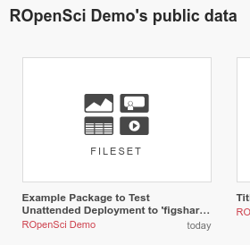

# tic.figshare

A minimal example that uploads artifacts to a [figshare sandbox](https://figshare.com/authors/ROpenSci_Demo/453074) using _tic_.
The sandbox is purged regularly, but if you're lucky you might access the most recent artifact from there:

_tic_ is an R package for CI-agnostic workflow definitions for various R projects. 
See its [documentation](https://ropenscilabs.github.io/tic/) for more information.

## Differences to a conventional CI setup

Only a few files need to be added or changed to enable integration with _tic_:

- [`tic.R`](tic.R): This file describes the CI workflow.
- [`.travis.yml`](.travis.yml): This file translates between CI stages of Travis CI and _tic_ stages.
- [`appveyor.yml`](appveyor.yml): This file translates between CI stages of AppVeyor and _tic_ stages.
- [`.Rbuildignore`](.Rbuildignore): The listed files should not be part of the R package building process and must be excluded.

## Set up an operational fork of this repository

If you want to experiment with _travis_ and _tic_ for a _figshare_ project, you can fork it.

1. Use `usethis::create_from_github()` to automatically create a fork of this repo.
    If you use RStudio, a new RStudio project will open. 
    You may need to set up your SSH credentials first. 
    See [this guide](http://happygitwithr.com/ssh-keys.html) if you're having problems. 
    (It's definitely worth getting this function running as it saves you a lot of time in the future!) 
    Alternatively, fork this repo on Github and then create a new R Project within RStudio (File -> New Project -> Version Control -> Github). 
1. Run `tic::use_tic()` to set up all requirements needed for the CI integration of your package.
